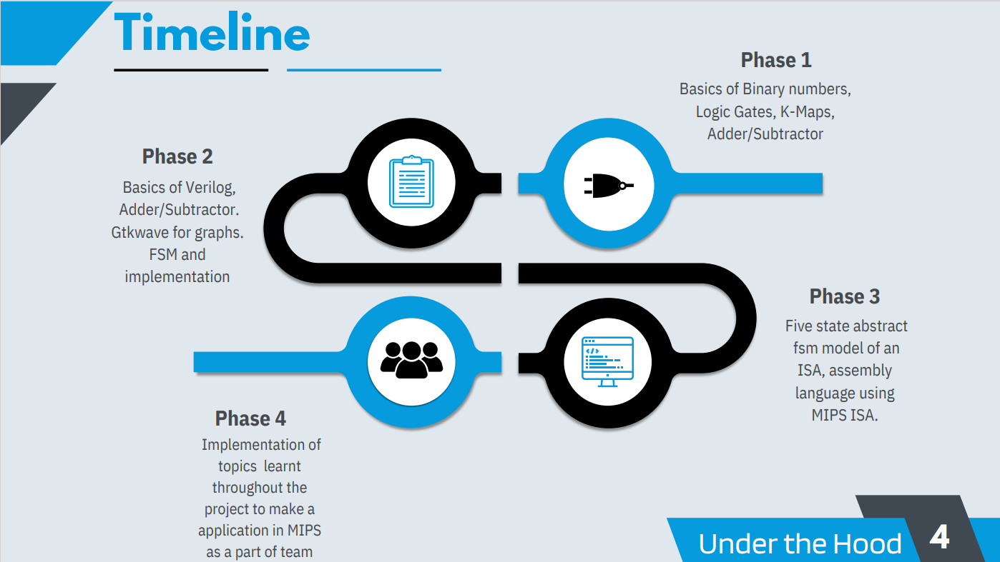
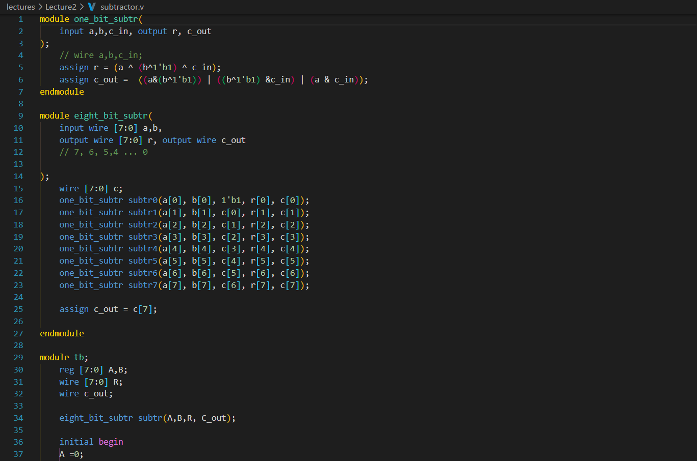
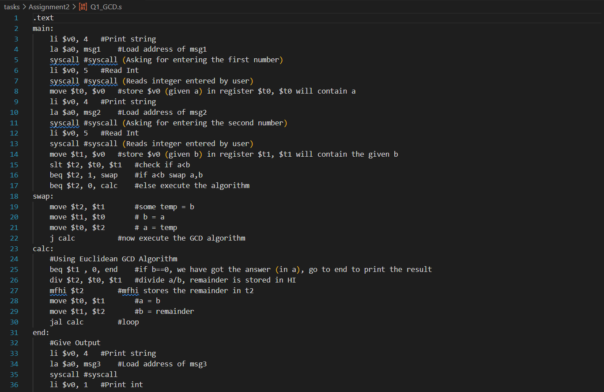
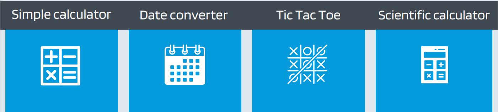
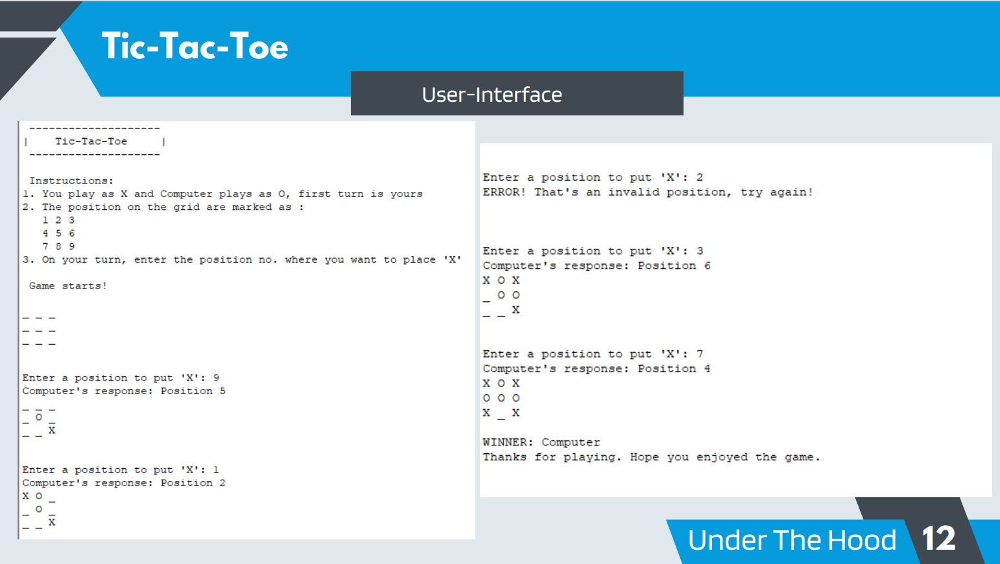
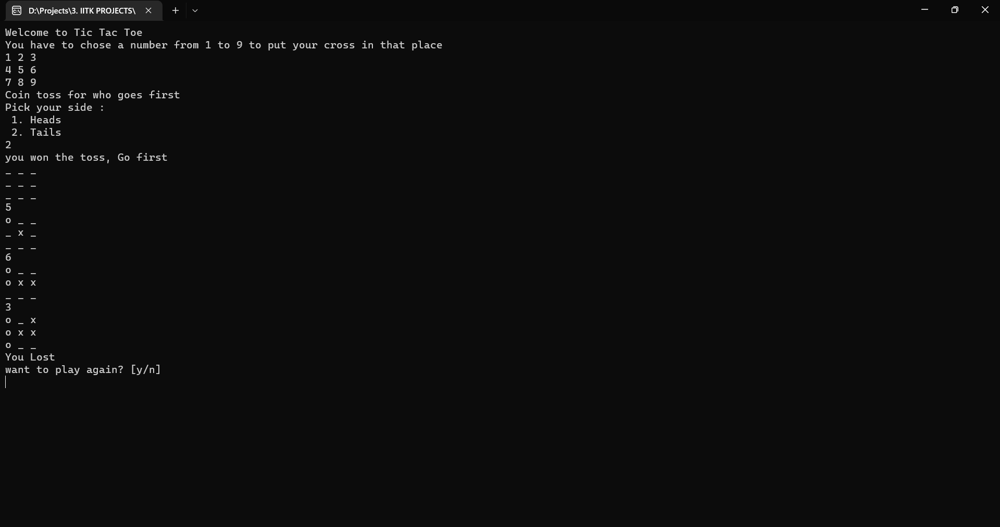

# UNDER THE HOOD

_**Summer Project '22**, Programming Club, IIT Kanpur_
_**Mentor**: Aditya Tanwar, Akhil Aggarwal_

The project was conducted in 4 phases represented on the timeline :

Topics covered in the four phase were:

1. **Basics of Digital Electronics** -

   - Binary Representation
   - 1's complement & 2's complement
   - Boolean Operators and Logic Gates (AND, OR, NOT, NOR, XNOR, Universal - NAND, NOR)
   - Truth Tables and Logic Functions
   - K-Maps, minterm, maxterm
   - Adder & Subtractor circuits

2. **Digital Logic Design in Verilog** -

   - Basics of Verilog
   - Adder, Subtractor, MUX, Comparator
   - GTKWave for Graphs
   - FSM and implementation

3. **Assembly Languages & MIPS** -

   - Basics of MIPS
   - Five State Abstracgt FSM Model of an ISA
   - Assembly Language using MIPS ISA
  

1. **Making Game using Verilog & MIPS** -
   - Unbeatable TicTacToe
   - Date Converter
   - Scientific Calculator
   - Simple Calculator

### IMPLEMENTATION PHASE:

# Unbeatable Tic-Tac-Toe Game
### Written by team: [QTSIMP](https://github.com/laveshg21/UnderTheHood-210562/blob/3efe375d9768d826467191cc08d2b1a1dbe52b72/Teams/qtsimp/README.md)

The final phase of the project required us to implement a **Tic Tac Toe** game in **MIPS Assembly Language**. Creation of user interface and the algorithm for finding the _best computer move_ were needed to be coded.

The interface contains the current status of the board like:

> \_ \_ _  
> O X _  
> O \_ \_  

User always has the first turn. And the user can continue his turn by entering the desired position as input:

> 1 2 3  
> 4 5 6  
> 7 8 9  

At the end, the game tells who won. Interface (in MIPS) is shown below:

I also implemented the **Mini-Max Algorithm** to code the **Tic-Tac-Toe** in **C++ as well as JAVA Programming language**. The interface for C++ program is shown below:

---

**Projects made by other teams were:**

#### 2. Date Converter

Team name - [rishi_abir_dhruv_vishant](https://github.com/HyBobu/rishi_abir_dhruv_vishant-UnderTheHood/blob/master/Teams/rishi_dhruv_abir_vishant/README.md)

The final phase of the project required us to implement a Date Converter using MIPS Assembly Language.
It has the following two functions

1. To convert the date into a required format(eg - DD/MM/YYYY)
2. To check what was the weekday on that date

The program takes 3 inputs initially - Date, Month and Year. Then you have to choose the required format and
then it asks you if you want to know the weekday or not. There is also a restart option at the end so that
you can add another date.

#### 3. Simple Calculator

Written by Team : [Surviving with Google](https://github.com/suvratp21/UnderTheHood/blob/master/Surviving%20with%20Google/README.md)

The final phase of the project required us to implement a <i>Simple Calculator</i> in MIPS Assembly Language.
It has following functionalities on integers.

1. Addition (+)
2. Subtraction (-)
3. Multiplication (\*)
4. Division (/)
5. Modulus (%)

The calculator takes a single integer at a time followed by an operator. Then it takes a second integer and prints the current answer.
The calculator will perform the operations till '=' operator is encountered or an error occurs.
 

#### 4. Scientific Calculator

Written by- [Y00010100](https://github.com/akhilagrawal1001/UnderTheHood/blob/78b4c05056ac2306a43952306f5dff377758154f/Teams/Y00010100/README.md)

We have developed a Scientific calculator which can do the following operations on the two numbers a and b given in the input:

1. a^b modulo 4999
2. logb a
3. gcd of a,b
4. lcm of a,b
5. a(1/b)

The interface shows all the instructions for the users to operate the Scientific Calculator. Users can refer to the interface and continue using the calculator.
